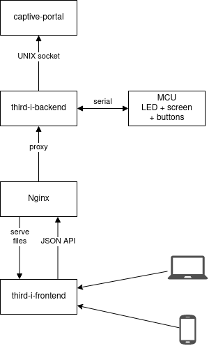

Third-I installation script
===========================

Prerequisites
-------------

 *  Python >= 3.5
 *  pipenv
 *  node >= 8.17.0, npm >= 6.13.4
 *  ssh with GitHub access to the repositories

Installation
------------

This script works on top of the provided StereoPi image.

Run it using ssh:

```
./install.sh root@stereopi.lan
```

Obtaining logs
--------------

1.  Logs of the captive-portal component:

    ```
    journalctl -u captive-portal@wlan0 -S today
    ```

2.  Logs of the third-i-backend component:

    ```
    journalctl -u third-i-backend@wlan0 -S today
    ```

3.  Logs of the Nginx proxy:

    ```
    tail -f /var/log/nginx/access.log
    tail -f /var/log/nginx/error.log
    ```


